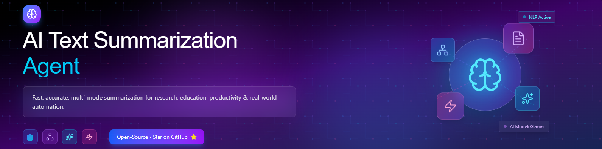

# 🚀 AI Text Summarization Agent | Gemini 2.5 Flash

<p align="center">
  
</p>


[](https://github.com/pratyushmishra9920-ship-it/AI-Text-Summarization-Agent/stargazers)


A **production-ready, multi-mode text summarization system** powered by **Gemini 2.5 Flash**, offering short, medium, long, bullet, simple and professional summaries with **keyword extraction, sentiment analysis**, and **a single-line final takeaway**.  
Built as a real-world deliverable project during the **Google 5-Day AI Intensive — Capstone Project**.

---

## ✨ Features
- Multiple summarization modes: **Short / Medium / Long / Bullets / Simple / Professional**
- **Automated Keyword Extraction**
- **Sentiment Analysis** (Positive / Neutral / Negative)
- **One-Line Takeaway**
- **Formatted PDF Export** (Layout + headings + watermark)
- **CSV Export**
- Fully built in **Kaggle / Jupyter Notebook** using Python & ReportLab

---

## 📌 Table of Contents
- [Features](#-features)
- [Project Files](#-project-files)
- [Tech Stack](#-tech-stack)
- [Installation](#-installation)
- [Usage](#-usage)
- [Future Improvements](#-future-improvements)
- [Acknowledgment](#-acknowledgment)
- [Contact](#-contact)
- [Support](#-support)

---

## 📂 Project Files
| File | Description |
|------|------------|
| `capstone-project.ipynb` | Full development notebook |
| `AI_Report_Final.pdf` | Example generated PDF |
| `sample_submission.csv` | Example output |

---

## 🧠 Tech Stack
- Python
- Gemini 2.5 Flash
- Pandas
- Matplotlib
- ReportLab
- Kaggle / Jupyter Notebook

---

## ⚙️ Installation
```bash
# Clone the repository
git clone https://github.com/pratyushmishra9920-ship-it/AI-Text-Summarization-Agent.git

# Move into the project directory
cd AI-Text-Summarization-Agent

# Install dependencies
pip install -r requirements.txt
```

---

## ▶️ Usage
```bash
# Run notebook locally
jupyter notebook capstone-project.ipynb
```

Or open in **Kaggle**, upload `capstone-project.ipynb`, and run all cells.  
The PDF report will be generated automatically.

---

## 🚧 Future Improvements
- Add comparison between multiple AI models
- Add visualization dashboard
- Build web UI using **Gradio / Streamlit**
- Deploy on **Hugging Face**

---

## 🤝 Acknowledgment
Created as part of **Google AI 5-Day Intensive Capstone Program**, driven by my passion for AI & ML.

---

## 📬 Contact
**Pratyush Mishra**  
Kaggle: https://www.kaggle.com/pratyushmishradev
LinkedIn: https://www.linkedin.com/in/pratyush-mishra-758a0339a/

---

## ⭐ Support
If you find this project useful, please **star the repository**. Your support encourages further improvements!

